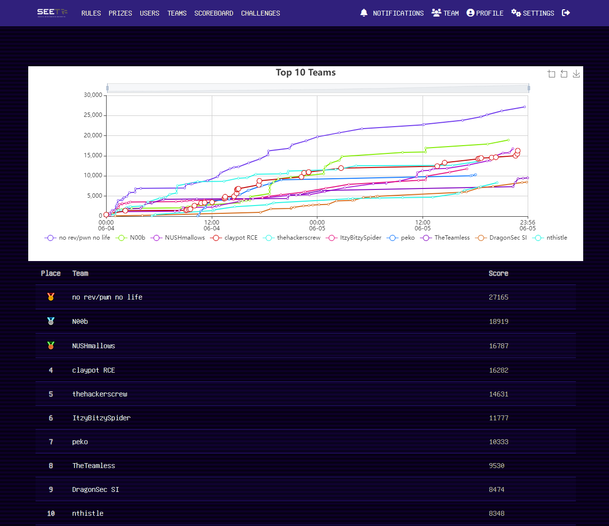

# SEETF 2022

Participated as team `Claypot RCE` with [`Lord_Idiot`](https://lord.idiot.sg/) and [`limli`](https://limli.github.io/), we got 4th.

## Writeups

- [Probability](probability.ipynb)
- [To Infinity](to_infinity.ipynb)
- [WeirdMachine](weird_machine.ipynb)
- [Others](others.ipynb)

## Solves

| Challenge                                           | Category        | Value | Time                  |
| --------------------------------------------------- | --------------- | ----- | --------------------- |
| 🤪  Welcome                                          | Misc            | 392   | June 4th, 12:00:12 AM |
| Probability                                         | Crypto          | 988 🩸 | June 4th, 2:10:47 AM  |
| 🧑&zwj;🎓 Wayyang.py                                  | Pwn             | 100   | June 4th, 9:04:49 AM  |
| 🧑&zwj;🎓 4mats                                       | Pwn             | 100   | June 4th, 9:11:40 AM  |
| Easy Overflow                                       | Pwn             | 100   | June 4th, 9:24:52 AM  |
| "as" "df"                                           | Pwn             | 100   | June 4th, 9:34:29 AM  |
| Pokemon Battle                                      | Pwn             | 842   | June 4th, 10:02:28 AM |
| Hall of Fame                                        | Pwn             | 655   | June 4th, 10:48:17 AM |
| 🧑&zwj;🎓 Sourceless Guessy Web (Baby Flag)           | Web             | 100   | June 4th, 11:11:57 AM |
| 🧑&zwj;🎓 Bonjour                                     | Smart Contracts | 100   | June 4th, 12:02:40 PM |
| Duper Super Safe Safe                               | Smart Contracts | 919   | June 4th, 1:25:39 PM  |
| 🧑&zwj;🎓 Close Enough                                | Crypto          | 100   | June 4th, 1:32:01 PM  |
| 🧑&zwj;🎓 Lost Modulus                                | Crypto          | 335   | June 4th, 1:32:08 PM  |
| 🧑&zwj;🎓 Super Secure Requests Forwarder             | Web             | 100   | June 4th, 2:32:28 PM  |
| UniveRSAlity                                        | Crypto          | 757   | June 4th, 2:50:18 PM  |
| Rolls Royce                                         | Smart Contracts | 940   | June 4th, 2:52:37 PM  |
| Flag Portal (Flag 1)                                | Web             | 100   | June 4th, 2:56:29 PM  |
| Flag Portal (Flag 2)                                | Web             | 100   | June 4th, 3:02:57 PM  |
| WeirdMachine                                        | Misc            | 971   | June 4th, 5:21:37 PM  |
| Star Cereal Episode 3: The Revenge of the Breakfast | Web             | 991   | June 4th, 5:25:52 PM  |
| RC4                                                 | Crypto          | 977   | June 4th, 10:12:18 PM |
| Pointy Tail                                         | Pwn             | 999   | June 4th, 10:30:37 PM |
| 🧑&zwj;🎓 Regex101                                    | Misc            | 100   | June 4th, 11:01:20 PM |
| Join our Discord                                    | Misc            | 100   | June 4th, 11:01:49 PM |
| 🤪 To Infinity                                       | Misc            | 991   | June 5th, 2:42:49 AM  |
| Sourceless Guessy Web (RCE Flag)                    | Web             | 481   | June 5th, 1:38:55 PM  |
| 🧑&zwj;🎓 Username Generator                          | Web             | 856   | June 5th, 2:29:39 PM  |
| The Pigeon Files                                    | Web             | 964   | June 5th, 6:18:20 PM  |
| 🧑&zwj;🎓 Sniffed Traffic                             | Forensics       | 100   | June 5th, 6:27:38 PM  |
| 🧑&zwj;🎓 Angry Zeyu2001                              | Misc            | 100   | June 5th, 6:38:45 PM  |
| 🧑&zwj;🎓 BestSoftware                                | Reversing       | 100   | June 5th, 7:50:25 PM  |
| Survey                                              | Misc            | 100   | June 5th, 8:18:47 PM  |
| Stomped                                             | Reversing       | 365   | June 5th, 10:33:26 PM |
| Pigeonsurf                                          | Misc            | 484   | June 5th, 10:45:22 PM |
| You Only Have One Chance                            | Smart Contracts | 775   | June 5th, 10:48:30 PM |

## Scoreboard

| Place | Team                  | Score |
| ----- | --------------------- | ----- |
| 🥇     | no rev/pwn no life    | 27165 |
| 🥈     | N00b                  | 18919 |
| 🥉     | NUSHmallows           | 16787 |
| 4     | **claypot RCE**       | 16282 |
| 5     | thehackerscrew        | 14631 |
| 6     | ItzyBitzySpider       | 11777 |
| 7     | peko                  | 10333 |
| 8     | TheTeamless           | 9530  |
| 9     | DragonSec SI          | 8474  |
| 10    | nthistle              | 8348  |
| 11    | willwam845            | 6712  |
| 12    | DistributedLivelock   | 6581  |
| 13    | MATE                  | 6497  |
| 14    | rabbitsthecat         | 6187  |
| 15    | 5h4d0wbl0k3r          | 5950  |
| 16    | Syscallers            | 5809  |
| 17    | corax                 | 5743  |
| 18    | lot_tich              | 5589  |
| 19    | 3_Blind_Mice          | 5422  |
| 20    | VMP                   | 5310  |
| 21    | Tommy Xiaomi          | 5046  |
| 22    | EggRoll               | 5030  |
| 23    | AverageCryptoEnjoyers | 4789  |
| 24    | qiaoqiao              | 4754  |
| 25    | CHKL                  | 4712  |
| 26    | EvilBunnyWrote        | 4582  |
| 27    | bruh                  | 4354  |
| 28    | pymi                  | 4104  |
| 29    | Showbiz               | 4064  |
| 30    | Havce                 | 3918  |
| 31    | fibonhack             | 3834  |
| 32    | dohki                 | 3634  |
| 33    | Task_Hashed           | 3478  |
| 34    | PwnProphecy           | 3452  |
| 35    | Hyphen                | 3289  |
| 36    | purf3ct               | 3203  |
| 37    | tmpCTF                | 3161  |
| 38    | AuroraDawn            | 3122  |
| 39    | l3gi0n                | 3073  |
| 40    | AT16 SQUAD            | 3057  |
| 41    | s                     | 3047  |
| 42    | NestingDollTeamX      | 3047  |
| 43    | Weak But Leet         | 3001  |
| 44    | SpringRoll0xA5NYIT    | 2949  |
| 45    | hash_hash             | 2947  |
| 46    | InfoSecIITR           | 2922  |
| 47    | \_0x90\_              | 2901  |
| 48    | wgpsec                | 2856  |
| 49    | CyberCraze            | 2849  |
| 50    | Batty McBatterson     | 2767  |
