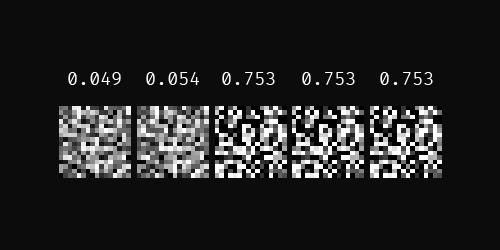
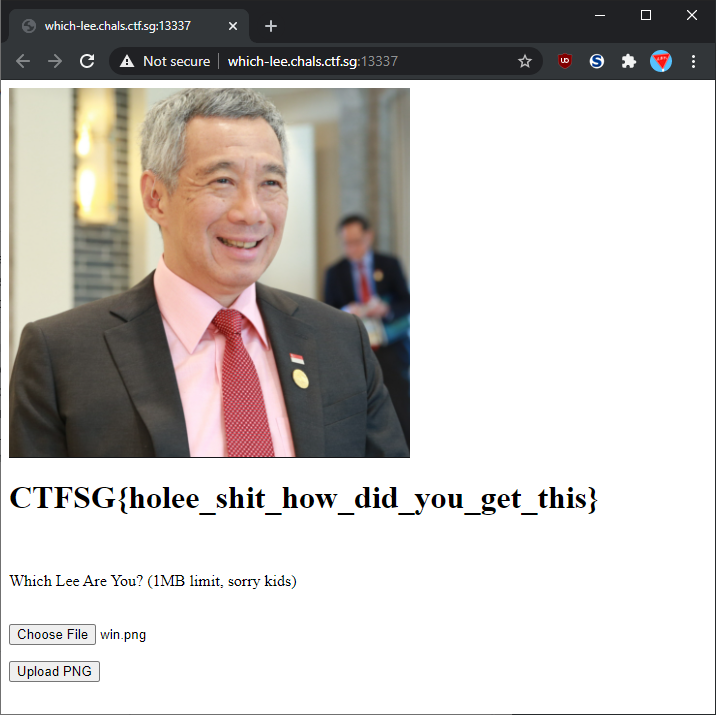

# Which Lee?

> 992 | MISCELLANEOUS
> 3 SOLVES
> 
> Which Lee do you want to be? Can you be the best Lee of them all?
> 
> Find out which Lee you are at this website!
> 
> p.s. we are using pytorch 1.8.0+cpu
> 
> Hint: Numerical InstabiLEEty
> 
> Author: waituck
> 
> [Attachment: distrib.zip](./challenge/distrib.zip)

# Recon

The challenge files have a specification and a trained modelfor a simple neural network image classifier, supposedly able to distinguish different pictures of people named 'Lee'. The `eval.py` script seems to accept a path as input and spits out the label of the supplied image. We also get access to a web page to upload our own images and run it against the classifier.

After searching around for a bit and inspecting the webpage source, it seems like our goal is to get an image labelled as `0` and have the server tell us it is a picture of Lee Hsien Loong. Let's then try to generate an adversarial image that will be classified with our label.

> Side note: Getting an ML environment running on your CTF machine is more effort than its' worth. For most of this challenge I used a [paperspace VM](https://www.paperspace.com/) which came with pyTorch ready to go. Others may prefer [Google Colab](https://colab.research.google.com/) (remember those [dame dane memes](https://youtu.be/BDqhcDhcpW4?t=74)?)

# Adversarial Images

We can copy-paste the model class from `eval.py` into our own script with all the respective imports, then load the trained model.

```python
import torch
# <snip>

class LeeNet(nn.Module):
    def __init__(self, nFeatures=NFEATURES, nHidden=NHIDDEN, nCl=NCL):
        super().__init__()
        # <snip>

model = LeeNet()
model.load_state_dict(torch.load("./leenet.ph"))

for param in model.parameters():
    param.requires_grad = True
```

Inspecting `eval.py` we know that the model will scale down images to a 16 by 16 pixel grayscale image and eventually report probabilities for 5 different labels.

To make an adversarial image, we need to:

1. Create a (random?) image to start with
    ```python
    im_np = np.random.rand(1, 256)
    ```

1. Convert it to a pyTorch tensor and enable gradient calculation
    ```python
    im_tensor = torch.Tensor(im_np)
    im_tensor.requires_grad = True
    im_tensor.grad = None
    ```

1. Pass it through the model
    ```python
    preds = model(im_tensor)
    print(preds)
    ```

    ```
    tensor([[0.0497, 0.2014, 0.0635, 0.0497, 0.6358]], grad_fn=<SoftmaxBackward>)
    ```

1. Evaluate its loss compared against the label we want
    ```python
    target = torch.empty([1], dtype=torch.long)
    target[0] = 0 # Lee Hsien Loong
    loss = nn.CrossEntropyLoss()
    output = loss(preds, target)
    ```

1. Get the gradient of the input tensor and re-apply that to our original image
    ```python
    output.backward()
    new_im_tensor = im_tensor - im_tensor.grad * 100 # 100 is our 'learning rate'
    new_im_np = new_im_tensor.detach().numpy().clip(0, 1)
    ```

1. Then rinse and repeat until our image is labelled with strong enough probability
    ```
    tensor([[0.0543, 0.3608, 0.0543, 0.0543, 0.4764]], grad_fn=<SoftmaxBackward>)
    tensor([[0.7528, 0.0618, 0.0618, 0.0618, 0.0618]], grad_fn=<SoftmaxBackward>)
    tensor([[0.7528, 0.0618, 0.0618, 0.0618, 0.0618]], grad_fn=<SoftmaxBackward>)
    tensor([[0.7528, 0.0618, 0.0618, 0.0618, 0.0618]], grad_fn=<SoftmaxBackward>)
    ```

    

1. Save the image and then test it on the challenge website

    ```python
    new_im_np = (new_im_np * 255).astype(np.uint8).reshape((16, 16))
    new_im = Image.fromarray(new_im_np)
    new_im.save(f'test.png')
    ```

Unfortunately, submitting this to the website seems to get label `1`? We can check this against the `eval.py` script provided, and it also returns `1`!

```python
import subprocess
!mkdir -p /test/test
new_im.save(f'test/test/test.png') # The eval script expects more subfolders for whatever reason
print(subprocess.check_output(["python3", "eval.py", "./test/"]).decode())
# Prints '1'
```

We can dig a bit deeper into `eval.py` and we notice the bottom of the file:

```python
# eval.py
y_pred = model(image)
print(y_pred)
# tensor([[0.7528, 0.0618, 0.0618, 0.0618, 0.0618]])

# no flag for you :P
y_pred[:,0] = torch.min(y_pred) - EPS
print(y_pred)
# tensor([[0.0618, 0.0618, 0.0618, 0.0618, 0.0618]])
# Internally the first 0.0618 was a fraction smaller than the rest

decision = torch.argmax(y_pred)
print(str(int(decision)))
```

The script sets the probability of label `0` to less than the probabilities of all other labels, so the call to `argmax` will never return the label `0`.

# Float glitching

My hunch was that there may be one or two floating point precision errors, either inside the neural network itself or a possible error that might happen during the probability overwrite. Either way, I set up a script to keep generating adversarial images until `eval.py` returns label `0`, and it worked after 337 tries!

```python
while True:
    generate_adversarial(0, prefix=f'test/test/test.png', debug=False)
    output = subprocess.check_output(["python3", "eval.py", "./test/"]).decode().strip()
    print(output)
    if output == '0':
        break
```

```
1
1
1
1
... 330 more lines
4
1
0
```

We can submit that image and get the flag.

```
CTFSG{holee_shit_how_did_you_get_this}
```



[Jupyter notebook for this solution](./ugly-solve.ipynb)

# Intended Solution / Why this works

We can re-run `eval.py` on the winning image and find out what happens.

```python
# eval.py
y_pred = model(image)
print(y_pred)
# tensor([[nan, nan, nan, nan, nan]])
```

Looks like our image somehow managed to cause the prediction to turn into `nan`? With a few more `print` statements placed inside the `LeeNet()` class we find that this happens:

```python
class LeeNet(nn.Module):
    def forward(self, x):
        # <snip>

        x = F.relu(self.fc2(x))
        print(x)
        # tensor([[0.000, 0.000, 0.000, 0.000, 0.000]])

        x = F.layer_norm(x, x.size()[1:], eps=1e-50)
        print(x)
        # tensor([[nan, nan, nan, nan, nan]])

        # <snip>
```

When output of the `fc2` layer is all negative, the `relu` layer sets all elements to the same value of zero. `layer_norm` will then try to divde the `relu` output by its variance, which in this case is zero and the cause floating point error, finally returning `nan`.

To more quickly generate an image that can trigger this bug, we want to create adversarial images that create a all-zero output after `F.relu(self.fc2(x))`. We can make two extra tweaks to our prior solution:

1. Trim down the `LeeNet()` class and remove its normalization and softmax layers.
    ```python
    class LeeNet(nn.Module):            
        def forward(self, x):
            nBatch = x.size(0)

            x = x.view(nBatch, -1)
            x = F.relu(self.fc1(x))
            x = F.relu(self.fc2(x))
            
            # Newly removed
            # x = F.layer_norm(x, x.size()[1:], eps=1e-50)
            # probs = F.softmax(x, dim=1) 
            
            return x
    ```

1. Adjust our loss function to accept the larger output of the model and set the desired label as 'all zeros'.
    ```python
    def step_adversarial(im_np, lr=100):
        # <snip>
        preds = model(im_tensor)
        target = torch.empty([1, 5]).fill_(0)
        loss = nn.L1Loss()
        output = loss(preds, target)
        output.backward()
        # <snip>
    ```

With this, we will generate an image that triggers this bug every time! 

[Jupyter notebook for this solution](./solve.ipynb)
