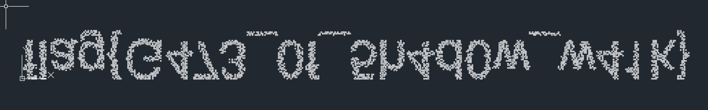
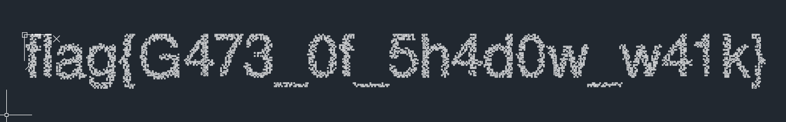
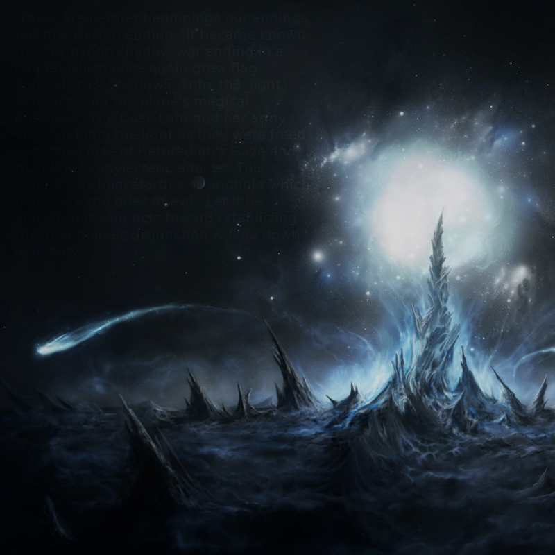
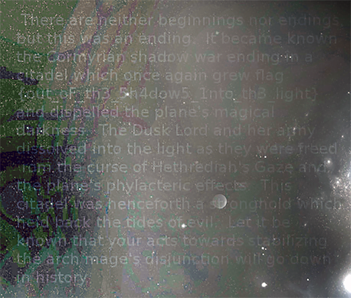

# Orb of Light 1,2,3 - SwampCTF 2018 (476,500,500)

## Orb of Light 1: Secret (476)

> You are about to embark on a quest to learn about the Orb of Light.
> 
> Note: Case matters.
>
> Note: Flag's submitted must be in this format flag{[a-zA-Z0-9_-]+}
>
>-=Created By: randompast=-
>
> [Orb_of_Light_p1_secret_message.zip](challenge/Orb_of_Light_p1_secret_message.zip)

After unzipping, [secret_message.txt](challenge/Orb_of_Light_p1_secret_message/secret_message.txt) contains some garbled text but has properties such as word length and formatting preserved:

```
gh2AtAht hS zRfghLz ftg otozofE WRAtTz

"WhdAa gh2fAt hS gf9G AEEozAht
```

This makes it a likely substitution cipher.

Passing the garbled text through quipqiup.com gives:

```
do2InIon oF sHadoWs and unusuaL THInNs

"To?Ii do2aIn oF da9D ILLusIon 
```

Alright, slightly better but still not perfect. Quipquip seems to ignore substituting numbers and is neither case sensitive. At this point, manually assigning the remaining letters with a python script helps reach a 100% sensible english output:

```python
encoded  		= "gh2AtAht hS zRfghLz ftg otozofE WRAtTz WhdAa gh2fAt hS gf9G AEEozAht" # ...
bad_plaintext 	= "do2InIon oF sHadoWs and unusuaL THInNs To?Ii do2aIn oF da9D ILLusIon" # ...

cipher = {}
for i in range(len(encoded)):
  cipher[encoded[i]] = bad_plaintext[i].lower()

# Manual cipher amendments
cipher['2'] = 'm'
cipher['T'] = 'g'
# ... ...
cipher['d'] = 'x'
cipher['r'] = 'v'

plaintext = ""

for i in encoded:
  if i in cipher:
    plaintext += cipher[i]
  else:
    plaintext += i

print plaintext
# "dominion of shadows and unusual things toxic domain of dark illusion" # ...
```

Though there is legible text, there is still no sign of a flag. However, when you print the cipher dictionary itself:

```python
cipher_output = sorted( ((v,k) for k,v in cipher.iteritems()), reverse=False)

print cipher_output
# [(' ', ' '), ("'", "'"), (',', ','), ('.', '.'), (':', ':'), ('a', 'f'), ('b', '
l'), ('c', 'a'), ('d', 'g'), (
```

See the flag? 

Print out the values sorted by their key and you have something that looks quite reasonable:

```python
flag = "" 
for i,j in cipher_output:
  flag += j
  
print flag
#  ',.:flagSTRANGE2thin9zWorLdZ
```

Wait, where is the `{}`? Well turns out `e` and `z` are not show in the plaintext, so manually adding in their key-value pairs into the cipher gets us the complete flag:

```python
cipher['{'] = 'e'
cipher['}'] = 'z'

# ... ...

print flag
#  ',.:flag{STRANGE2thin9zWorLdZ}
```

### [Full Solution](orb1_solve.py)

## Orb of Light 2: Save Cormyr (500)

> Use the secret discovered from the book to access these documents [insert flag1 to unzip].
> 
> Note: The DMs suggest that you use p7zip-full (7za) to extract as Debian/Ubuntu versions of unzip are too old.
> 
> Note2: This challenge has been updated and is now solvable
> 
> -=Created By: randompast=-
> 
> [Orb_of_Light_p2_SaveCormyr.zip](challenge/Orb_of_Light_p2_SaveCormyr.zip)

After extracting [Orb_of_Light_p2_SaveCormyr.zip](challenge/Orb_of_Light_p2_SaveCormyr.zip) with password `flag{STRANGE2thin9zWorLdZ}`, the most interesting data is a [491kb python pickle file](challenge/Orb_of_Light_p2_SaveCormyr/page_of_numbers.p). Attached is also two files of examples, one with printed tuples and another pickle file, seemingly with data the same as the first large file except with two more integers.

Instinctively, the first task would be to solve all tuples in the large file for its list of integers, then we'll see where we go from there.

From the [story so far](challenge/Orb_of_Light_p2_SaveCormyr/story.txt), it suggests that the 5 values in a question tuple correspond to:

```python
(-804.1791798191063, 207.81139231370207, 100.82602527985537, 1.080075821502287, 		2.9241898277603076)
# ^  x coordinate    ^ y coordinate      ^ speed             ^ angle above horizontal   ^ bearing
```

And each tuple describes a 'spell' projectile that is cast. Gut feeling tells me that the projectiles obey gravity and takes a parabolic path through the air, of which a solution tuple (`(22, 37)` in this case) would be the coordinate where it hits the ground again.

Rephrasing the problem:

> For a projectile with given x-y coordinates and z-coordinate = 0, projected at some angle in radians above the horizontal and with bearing, find the x-y coordinate that it reaches z=0 again.

Using some elementary school math (that I won't go into) and after raging for a good five hours because the answer tuple was actually in the form (y,x), I was able to [verify the math with the example pickle file](orb2_verify.py) and then [obtain the tuples needed](orb2_solve.py) from [the page of numbers pickle](challenge/Orb_of_Light_p2_SaveCormyr/page_of_numbers.p), getting [a json of the results](orb2_coords.json).

Ok, so the first part of the problem is over, now just to visualize the points. I happened to have AutoCAD on hand and after some editor magic turned the json into a [batch script for cad](orb2_plot.scr) to plot circles with each point.

Result:



Whoops. Lets flip it:



`flag{G473_0f_5h4d0w_w41k}`

## Orb of Light 3: Disjunction (500)

> The skyborn oozing darkness nearly had us. Had you failed surely our kingdom would have fallen to the tides of shadow from the [insert flag2 to unzip].
> 
> Note: The DMs suggest that you use p7zip-full (7za) to extract as Debian/Ubuntu versions of unzip are too old.
> 
> -=Created By: randompast=-
> 
> [Orb_of_Light_p3_disjunction.zip](challenge/Orb_of_Light_p3_disjunction.zip)

Once again, extracting the challenge with password `flag{G473_0f_5h4d0w_w41k}` gives us... another zip?

And if you unzip [.shadow_fragments.zip](challenge/Orb_of_Light_p3_disjunction/.shadow_fragments.zip) we get a bomb of a few thousand folders and png images. Using a quick .find to move all of them into one zip shows us that there are 6400 images, all with unique and running order filenames and  10 by 10 pixels large.

All we need to do is to piece together all the fragments. Since `6400 = 80^2`, let's try to use a [script](orb3_solve.py) to stitch together the fragments in an 80 by 80 grid:

```python
from PIL import Image

images = []
for i in range(6400):
	ims.append(".challenge/Orb_of_Light_p3_disjunction/all_frags/fragment-" + str(i).zfill(5) + ".png")

flag = Image.new("RGB", (800, 800))

for index, file in enumerate(ims):
  img = Image.open(file)
  x = (index % 80) * 10
  y = (index / 80) * 10
  w, h = img.size
  flag.paste(img, (x, y, x + w, y + h))

flag.save('orb3_flag.png')
```

Result:


Hmm, I can make out something in that top left corner too. With a bit of Photoshop magic:

Result:


`flag{out_oF_th3_5h4dow5_1nto_th3_light}`